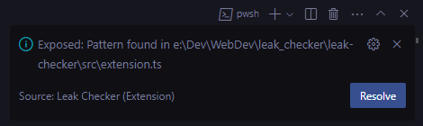

# Leak Checker

**Leak checker** is a small extension created for personal use to stop myself and anyone who use this extension from pushing sensitive information to the internet.

**Leak checker** scans the entire repository and checks for possible `.toml` files along with `api_keys` that are not present in .gitignore and throws a warning at the user in the information dialog box that there might exist a possible sensitive information that might result in havoc if unaddressed.

This will keep you secure and safe from leaking sensitive infos by constantly showing exposure warnings in the _bottom right corner_.

## Requirements

- VSCode needs to be installed
- Your repository must have some sensitive info that are not in .gitignore

## Build (Windows specific)

- Execute `winget install nodeJs` or `winget install OpenJS.NodeJS.LTS` and reload the terminal
- `npm init -y`
- `npm install --save-dev yo generator-code` (This will install dependencies into your work env and not globally. If you want to enable in global use `-g` instead of `--save-dev`)
- `npx yo code`
- `npm install fs glob`
- `cd` to `leak-checker`
- Press `F5` to run the integration test
- `npm install -g @vscode/vsce`
- Execute: `vsce package` to export the `Leak Checker` package

### Quick Note

I'm new to this and I believe this is not robust and will eat your RAM. So use with caution, you've been warned!

## Release Notes

### 0.2.0

Optimize the extension logic

### 0.1.0

Initial release of Leak Checker
